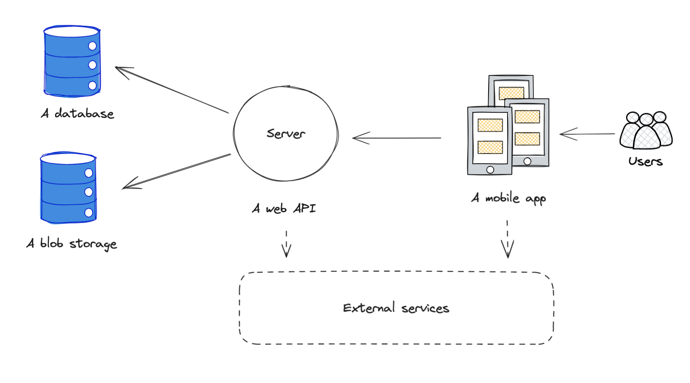

# Architektura

## Overview

Sama architektura aplikacji opierała się będzie o typowy schemat Client-Server poprzez API. Składać się na nią będą poszczególne elementy:

1. Aplikacja mobilna / frontend - to przez nią końcowi użytkownicy będą korzystać z rozwiązania, jednak w formie “wyglądu” - cała funkcjonalność będzie bazowała na komunikacji z serwerem poprzez API (2)
2. Serwer / backend - dostarczać będzie API spełniające postawione wymagania, zarządza danymi oraz implementuje całą logikę biznesową
3. Dane - baza/y danych przechowujące dane, zarządzane przez serwer (2). Na ten moment można wyspecyfikować dwie potrzebne bazy:
   1. Główna baza danych - przechowuje dane o użytkownikach, spotkaniach, etc.
   2. Storage - odpowiedzialny za przechowywanie mediów takich jak np. obrazki
4. Usługi zewnętrzne - usługi z których skorzystamy w celu dostępu do dodatkowych informacji lub integracji np. kalendarz, Google Maps etc.

## Technologia

Stack technologiczny na jaki się zdecydowaliśmy to:

1. Aplikacja mobilna / frontend - React Native / TypeScript (i pochodne biblioteki)
2. Serwer / backend - Spring Boot / Java (i pochodne biblioteki)
3. Dane / Storage / Hosting - (wstępnie) usługi chmurowe np. Google Cloud Platform (np. Firestore, Cloud Storage, Cloud Run)
